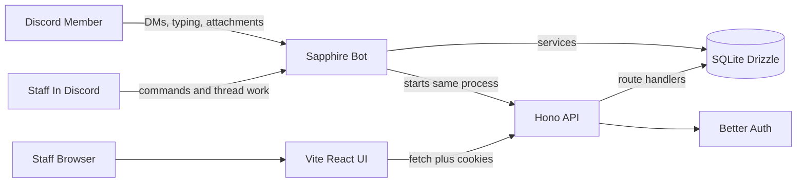

# Architecture

This context pack describes the current `imi/tickets` system for future agents. Keep it focused on durable boundaries, data flow, and conventions that should guide edits.

## System Map



The backend is one Node process. `CustomClient.login()` creates the SQLite/Drizzle connection, starts Hono on port `4000`, loads API routes, then logs into Discord.

## Stack

| Layer | Tool | Purpose |
| --- | --- | --- |
| Bot runtime | Node.js, TypeScript, CommonJS package output | Runs the Discord bot and Hono API process |
| Discord bot | Sapphire Framework, discord.js | Commands, listeners, Discord gateway events, message/thread behavior |
| HTTP API | Hono, `@hono/node-server` | REST endpoints and Better Auth mount |
| Auth | Better Auth with Discord OAuth | Staff/user browser auth through `/api/auth/*` |
| Database | SQLite, better-sqlite3, Drizzle ORM | Domain data plus Better Auth tables |
| Discord UI | Discord Components V2, Mustache | Bot-rendered message components with DB-overridable templates |
| Web UI | Vite, React 19, React Router 8, TanStack Virtual | Staff ticket interface and virtualized ticket timelines |
| API state | TanStack Query | Ticket/message queries and infinite pagination |
| Styling | Tailwind CSS v4, shadcn v4, Base UI, CSS variables | UI primitives and semantic design tokens |

Use `pnpm` for JavaScript commands in both repos. The backend has legacy script chains that call `npm run` internally; do not add new Bun, yarn, or npm-only instructions.

## First-Run Setup And Onboarding

New self-hosted deployments should guide the first user through setup after Discord OAuth login.

Flow:

```text
User opens website
  -> Discord OAuth login
  -> setup state check
  -> /onboarding full-screen stepper
  -> persist Discord server and ticket routing config
  -> normal app layout
```

Onboarding must cover:

- Primary Discord server selection/linking.
- Additional Discord servers to watch.
- Bot invite flow as needed for each selected server.
- Ticket channel handling. Choose exactly one strategy on the primary Discord server only:
  - Discord category with per-ticket channels.
  - Discord forum channel with per-ticket posts.
  Affiliated servers do not configure ticket routing.
- Staff role mapping per linked Discord server.
- Modular staff permissions. Start with `READ` and `MANAGE`, and model permissions so future modules can add more flags without rewriting role storage.

Onboarding completion is configuration state, not a security shortcut. APIs used during onboarding still require an authenticated setup owner and must not expose ticket data without RBAC authorization.

## Repository Boundaries

| Path | Owns |
| --- | --- |
| `/apps/bot` | Discord client, Hono API, route loading, Better Auth server, services, Drizzle schema/migrations, SQLite data, Discord component templates |
| `/apps/web` | Browser routes, layout, navbar/footer, ticket UI, TanStack Query hooks, API client wrapper, Better Auth React client, shadcn UI primitives |
| `/packages/shared` | Shared display-title helpers, Zod schemas, message/timeline types, realtime event union |

The UI does not own Discord side effects, database access, or auth server behavior. The bot/API does not own React route rendering or browser state.

## Backend Folder Structure

```text
apps/bot/
  src/index.ts
  src/lib/client.ts
  src/lib/auth.ts
  src/lib/api/
    load.ts
    resolve.ts
    route.ts
  src/commands/
  src/listeners/
  src/routes/
  src/services/
  src/database/sqlite/
    schema.ts
    auth.ts
```

The route loader reads compiled JavaScript from `dist/routes`, so backend route changes must be built before `node dist/index.js` can register them.

## Frontend Folder Structure

```text
apps/web/
  src/main.tsx
  src/App.tsx
  src/Ticket.tsx
  src/Staff.tsx
  src/Settings.tsx
  src/components/
  src/features/
    tickets/
      api/
      hooks/
      schemas/
      components/
      utils/
  src/lib/
    api.ts
    auth-client.ts
```

React routes are declared in `src/main.tsx`. Keep route shell files thin and move real feature behavior into `src/features/`.

## Ticket Data Flow

```text
Discord DM or staff command
  -> Sapphire listener/command
  -> service method
  -> Drizzle write/read
  -> SQLite
  -> audit log when state changes
```

For the web UI:

```text
React component
  -> feature hook
  -> TanStack Query
  -> feature API function
  -> src/lib/api.ts fetch wrapper
  -> Hono route
  -> service method
  -> SQLite
```

## API Route Pattern

API routes extend `Route` from `apps/bot/src/lib/api/route.ts` and default-export a class with `register(app, path)`.

```ts
export default class Tickets extends Route {
  register(app: Hono, path: string) {
    app.get(path, (c) => this.getTickets(c));
    app.get(path + "/:ticketId", (c) => this.getTicket(c));
  }
}
```

`loadRoutes()` walks `dist/routes`, imports each default-exported class, resolves file paths to Hono paths, then calls `register()`. `resolveRoutePath()` maps bracket path segments such as `[id]` to `:id` and catch-alls like `[...catch]` to `*`.

## Current API Contracts

| Endpoint | Current behavior |
| --- | --- |
| `GET /heartbeat` | Returns `"ok"` |
| `GET /tickets` | Requires product `READ`; query params: `cursor`, `search`, `status`, `userId`; returns `{ tickets, nextCursor }` |
| `GET /tickets/:ticketId` | Requires product `READ`; returns one thread or `{ error: "Ticket not found" }` with 404 |
| `GET /tickets/:ticketId/timeline` | Requires product `READ`; normal mode accepts `cursor` and returns `{ items, nextCursor }`; target-window mode accepts `messageId` or `windowCursor` + `direction=older|newer` and returns `{ items, previousCursor, nextCursor, anchorMessageId }` |
| `GET /messages` | Requires product `READ`; requires numeric `threadId`; optional `cursor`; returns `{ messages, nextCursor }` |
| `GET /messages/:messageId` | Requires product `READ`; returns one message or `{ error: "Message not found" }` with 404 |
| `GET /setup/status` | Requires Better Auth session, not completed onboarding; returns setup/RBAC bootstrap status |
| `POST /setup/claim` | Requires Better Auth session; atomically claims setup ownership |
| `GET|POST /setup/guilds` | Requires setup owner; lists Discord admin guilds or persists selected primary/additional guilds |
| `GET /setup/guilds/:guildId/resources` | Requires setup owner; returns roles and category/forum channels after bot invite |
| `PATCH /setup/guilds/:guildId/channel-strategy` | Requires setup owner; persists category/forum routing on the primary guild only |
| `PUT /setup/guilds/:guildId/roles` | Requires setup owner; replaces role permission matrix |
| `POST /setup/complete` | Requires setup owner; validates and completes onboarding |
| `GET /protected` | Requires product `READ`; stub |
| `GET /settings` | Requires product `READ`; unfinished and returns 501 |
| `GET|POST /api/auth/*` | Better Auth handler |

Timeline pages use a base size of 30 (or 15 on each side of a focused `messageId` seed) and may include up to 30 additional rows at each response edge to finish an adjacent visual message group. Group membership is defined in `packages/shared`: messages must share author and channel, be chronological and at most two minutes apart, and neither may be a reply or private staff note. Cursors always advance from the actual extended edge; audits and non-groupable messages stop extension immediately.

API success responses are plain JSON. Errors use `{ error: string }`, with product authorization adding `code: "ONBOARDING_REQUIRED"` or `code: "FORBIDDEN"` for 403 responses.

## Service And Database Pattern

Services live under `apps/bot/src/services/`. Current services are abstract classes with static methods, for example `TicketService.listTickets()` and `MessageService.listMessages()`.

Important patterns:

- `DbClient` is `Database | Transaction` from `services/types.ts`.
- Service methods that only read or compose can accept `db: DbClient = container.sqlite`.
- Multi-write operations use `container.sqlite.transaction((tx) => { ... })`.
- better-sqlite3 transactions are synchronous. Do not use `async` or `await` inside transaction callbacks.
- State-changing ticket operations should write audit entries through `AuditService.log`.
- Pagination currently uses numeric offset cursors and returns `nextCursor`.

## Auth And CORS

Better Auth is configured in `apps/bot/src/lib/auth.ts` with:

- Discord OAuth provider.
- Discord OAuth requests `guilds` so onboarding can list administrator guilds.
- Drizzle SQLite adapter.
- `baseURL: "http://localhost:4000"`.
- `trustedOrigins: ["http://localhost:5173"]`.

Hono CORS in `src/lib/client.ts` allows `FRONTEND_URL` (default `http://localhost:5173`) with credentials. Browser API calls that require session cookies should include credentials in the shared fetch wrapper.

API security middleware (same file): `secureHeaders` (with `crossOriginResourcePolicy: 'cross-origin'` for the SPA), then CORS, session, then `hono-rate-limiter` HTTP limits. `/ws` also wraps handlers with `webSocketLimiter` for inbound message floods. Details live in `lib/api/rate-limit.ts` and `context/library-docs.md`.

`src/lib/client.ts` also loads the Better Auth session into Hono context as `user` and `session` for route guards.

Bot command and private-message prefixes live in `config.settings` (`commandPrefix`, `privateMessagePrefix`). Member DM ingress applies `dmWordBlacklist` before ticket open/relay. Modal text fields may carry `wordFilter` rules validated on submit.

Message reactions are stored per human on the logical transcript message. Discord only mirrors one bot reaction per emoji onto each linked copy, so mirror removal must wait until the logical message has zero remaining human reactors for that emoji — not until the single Discord message that just lost a reaction is empty. Otherwise one participant clearing their reaction would wipe the staff/DM mirrors while others still have it.

Deleted Discord messages soft-delete the logical transcript row (`messageDelete` listener). Participant DM copies are removed; the staff channel copy is edited to a deleted placeholder (or a placeholder is posted if the staff-side source was deleted). Soft-deleted rows stay in the web timeline with a `(deleted)` marker.

Attachment rows may store Discord-provided `width`/`height` for images and videos. The staff timeline uses those for reserved `aspect-ratio` layout and TanStack Virtual `estimateSize`; older rows without dimensions keep the previous fixed fallbacks.

When `notifyOnNewThread` is enabled, `TicketChannelService` pings the configured roles (`<@&roleId>`) in the new ticket channel after provisioning (fire-and-forget so modal/report ack is not blocked). Presence-filtered user pings are temporarily disabled because Discord Presence Intent is not enabled.

Staff `;close` / slash close may take an optional duration or date (`24h`, `5m 28s`, `08/12`) to set `threads.scheduledCloseAt` instead of closing immediately. Scheduling posts the `scheduled-close-notice` system component in the staff channel and member DMs, stores those Discord message IDs (and the transcript audit id) on `threads.scheduledCloseNotices`, and writes a timeline audit marker (`----- Close Scheduled: <duration> -----`). `AutoCloseService` closes due tickets when `scheduledCloseAt` elapses — wake timing uses unix-second integer columns directly (not `strftime`). Any human message in the ticket channel or member DM clears that schedule, edits the stored Discord notices to a cancelled state, and **replaces** the existing schedule audit marker with `----- Close Schedule Cancelled -----` (same timeline slot — does not add a second marker). `;autoclose on|off` toggles `threads.autoCloseDisabled` so inactivity auto-close/reminders skip the ticket. `;snippets` lists enabled custom templates that have a `staffCommand`. Staff template command sends store `messages.staffCommand` (prefix + command) so the web transcript can show `(;faq)` next to `(edited)` / `(deleted)`.

Message group headers in the staff UI show historical `member_snapshots`. Hovering the author loads current Discord identity (and primary-guild roles when resolvable) from `GET /discord/users/:userId` (5-minute TanStack Query cache).

When `staffTicketOpenProfile` is enabled, the staff open-profile card is posted only in the staff channel/post and recorded as a System transcript row (human-readable display names and role names; user names link to Discord profiles for hover cards in the web UI). The `add` / `remove` / `participants` staff commands manage and inspect ticket participants; each successful `add` posts the same profile card (staff + transcript only). Staff who send a message or run a staff command in the ticket channel/post are recorded as `role=staff` participants (independent of `role=user` member rows — the same Discord user can appear in both). The `participants` command also backfills staff from prior staff-channel message authors.

`GET|PATCH /settings/whitelabel` (ADMIN) manages Discord whitelabel: per-guild bot member nick/avatar/bio via `guild.members.editMe` (Modify Current Member), and global presence (`statusText` + activity type) stored on `config.settings.whitelabelPresence` and re-applied on `clientReady` when set (otherwise the legacy ready status behavior remains).

`guildMemberAdd` / `guildMemberRemove` notify open tickets for any guild the bot is in (not only linked guilds): when an active `role=user` participant joins or leaves such a server, `GuildMembershipNoticeService` posts the `member-joined-guild` / `member-left-guild` Components V2 template in each of their open staff channels and records it as a private System transcript row (`isPrivateStaff`). Requires Guild Members Intent.

`thread_participants.dmUnreachable` tracks whether Discord rejects bot DMs to that member (closed DMs / no mutual guilds, codes 50007 / 50278). On add, the bot tries the contact DM first, then writes a timeline audit marker (`participant.added` with `dmUnreachable`) **before** the staff open-profile transcript row so the marker sorts above it (`@user added` / `@user added: DMs unavailable`). The Discord `member-dms-closed` notice is posted in the staff channel (pinging the member) without a duplicate transcript row. Later outbound DM failures / recoveries post short `member-dms-closed` / `member-dms-open` staff notices (with pings) and timeline audits (`participant.dms_unavailable` / `participant.dms_available` → `@user: DMs unavailable` / `@user: DMs available`) before the next delivered message is recorded.

## Custom RBAC

The project should use a custom RBAC layer on top of Discord OAuth identity.

Requirements:

- Protect all product API routes with RBAC. Ticket, message, settings, staff, onboarding, and future mutation routes should not rely on frontend checks or bare session presence.
- Product route handlers use the `@Protected()` method decorator from `src/lib/api/guards.ts`. It defaults to `READ`; pass permissions such as `@Protected(['read', 'manage'])` for stricter routes.
- `/api/auth/*` remains the authentication transport. If `GET /heartbeat` is kept for Docker health checks, it must not expose product data.
- RBAC decisions should be server-aware because staff roles are configured per linked Discord server.
- A Discord role can grant `READ` only, `READ` plus `MANAGE`, or future modular permissions.
- Keep permission names stable and easy to extend.
- Store enough configuration to answer: which servers are linked, which roles are staff roles, and which permission flags each role grants. Current tables are `linked_guilds` and `guild_staff_role_permissions`, with setup state on `config`.
- Before onboarding is complete, product routes normally return `ONBOARDING_REQUIRED`. If optional `PRIMARY_GUILD_ID` is set and there are no custom RBAC rows, product routes allow only Discord guild administrators in that guild.
- UI affordances should hide unavailable actions, but the backend is the authority.

## Discord Component Templates

Discord message components are modeled under `apps/bot/src/lib/components/`. The base `Component` class renders default Discord Components V2 structures, optionally overriding them with JSON templates stored in `message_templates`, and applies Mustache variables recursively.

When changing bot-facing messages:

- Prefer existing component classes before creating a new template system.
- Keep component IDs stable because DB overrides are keyed by ID.
- Use Discord Components V2-compatible structures.
- Treat malformed DB templates as operational data issues; do not silently change the storage contract without a migration plan.

Template management is exposed through protected API routes:

```text
GET/POST /templates
GET/PATCH/DELETE /templates/:id
POST /templates/:id/preview
GET /settings/system-components
GET/PUT /settings/dm-buttons
```

System component IDs are listed in `apps/bot/src/lib/components/registry.ts`. Rows in `message_templates` can override system components by ID or define custom templates used by DM buttons. Disabled template rows are ignored by the component renderer so code defaults remain the fallback.

## DM Button And Block Flows

Ticket-open category buttons are configured in `dm_open_buttons` and controlled by `settings.ticketOpenButtonMode`:

```text
off
  -> First member DM creates a ticket immediately.

before_open
  -> First member DM stores pending_ticket_opens row
  -> Bot replies with ticket-open prompt and dm_open:<buttonId> buttons
  -> Button click creates ticket from stored first message (button label = subject)
  -> Optional linked template forwards to staff when forwardTemplateButtonsToStaff is enabled
  -> Pending row clears.

Embedded template buttons (msg_btn:<templateId>)
  -> Button click renders linked template in member DM
  -> When forwardTemplateButtonsToStaff is enabled and member has open ticket,
     same rendered template is sent to staff channel/post

Modal buttons (msg_modal:<parentTemplateId>:<buttonId> or dm_open with action_type modal)
  -> Button click shows Discord modal (LabelBuilder fields: text, paragraph, select, radio, checkbox, role)
  -> On submit: optional linked template renders with modal field values as Mustache vars
  -> DM-open modal submit also opens the ticket (before_open flow); embedded modal submit does not
  -> forwardTemplateButtonsToStaff applies to submit templates when enabled
```

## Channel Ticket Panel

Optional guild-channel ticket entry is configured in `config.channel_panel_*` and `channel_open_buttons`. Staff publish the `ticket-channel-panel` system component (editable in Templates) to a text channel or forum post.

```text
Publish
  -> Staff enables panel, chooses text or forum channel, optional existing forum post
  -> POST /settings/channel-panel/publish posts or edits Components V2 message with channel_open:<buttonId> buttons

Member clicks channel_open button (or completes modal_submit:channel:<buttonId>)
  -> Block check + one-open-ticket check
  -> createDM(); TicketOpenService.openFromContent(skipOpeningMessage, subject from subjectTemplate Mustache)
  -> DM receives created component
  -> Linked post-click template forwards to staff when forwardTemplateButtonsToStaff is enabled
  -> Guild interaction gets ephemeral "Check your DMs"

Forum target
  -> Existing forumThreadId: panel message lives in that thread
  -> No forumThreadId on forum channel: publish creates a dedicated forum post and stores thread/message ids
```

Channel panel buttons support per-button `subjectTemplate` Mustache (`buttonLabel`, `user`, `userId`, `timestamp`, modal field IDs). Empty template falls back to button label.

Blocked users and roles live in `blocked_entities`. `BlockService.findBlockForUser()` checks direct user blocks and role blocks across linked guild memberships before ticket creation or button-driven ticket opens. Staff commands `block`, `blocked`, and `unblock` reuse the same service.

## Staff Opening Profile

New staff channels/forum posts can begin with a staff-only Component V2 profile before the member's first relayed message. This is controlled by `settings.staffTicketOpenProfile`, which defaults to `true`.

When enabled:

```text
TicketService.create()
  -> TicketChannelService.provisionFromContent(threadId)
  -> staff-only staff-ticket-open-profile component
  -> first member message relay component
```

The profile includes the member mention, account creation date, primary guild join date, previous ticket count, primary guild nickname, primary guild roles, and mutual servers. Mutual servers are every Discord server the bot is in where the member is also present (not limited to onboarded/linked guilds). The profile is never sent to the member DM.

When disabled, provisioning keeps the older one-message behavior: category channels send only the first relay message, and forum posts are created with the first relay as the initial post message.

## Ticket Channel / Post Naming

`settings.ticketChannelNameTemplate` is an optional Mustache template for new ticket channels and forum posts. When blank, defaults are:

- Forum posts: `#{{ticketId}} - {{username}}`
- Category text channels: `{{ticketId}}-{{usernameSlug}}`

Variables: `ticketId`, `username`, `usernameSlug`, `random` (per-ticket token stored on `threads.channel_name_random` at creation). Rendering and sanitization live in `apps/bot/src/lib/ticket/channelName.ts`.

The resolved name is stored on `threads.staff_channel_name` when the channel/post is created and updated on `rename`. It is kept after close so transcript titles remain stable. When `settings.useChannelNameForTranscript` is enabled, the staff site uses that name for ticket titles instead of `threads.subject`.

Staff can rename an open ticket channel/post with the `rename` command (`MANAGE` permission). Manual renames use literal text and the same Discord name sanitization rules.

## Staff Discord Commands

Staff commands live in `apps/bot/src/commands/` and implement both prefix and slash handlers where practical. Shared permission helpers in `apps/bot/src/lib/discord/staffCommand.ts` use `RbacService` against the current guild. Current staff commands:

```text
contact, logs, block, blocked, unblock, rename, about, help
```

`contact` opens one ticket per target member when possible. `logs` lists prior tickets for a member with web links. `rename` updates the Discord channel or forum post title for the current ticket. Block commands mutate or display `blocked_entities`.

## Invariants

- Backend services own persistence and ticket business rules.
- Hono routes parse/validate HTTP input and delegate to services.
- Product Hono routes must pass through the custom RBAC layer before returning ticket, message, settings, staff, or onboarding data.
- Discord commands/listeners should not duplicate complex service logic.
- UI code must not import backend source files or touch SQLite directly.
- The UI consumes API routes through `apps/web/src/lib/api.ts` and feature-level API modules.
- Auth server behavior belongs in `apps/bot`; browser session UX belongs in `apps/web`.
- First-run onboarding and later settings edits must use the same persisted server, channel-strategy, and RBAC configuration model.
- Do not reintroduce unrelated concepts such as organizations, Gateway-go, NATS, Paddle, Eden, or TanStack Start unless the codebase actually adds them.

